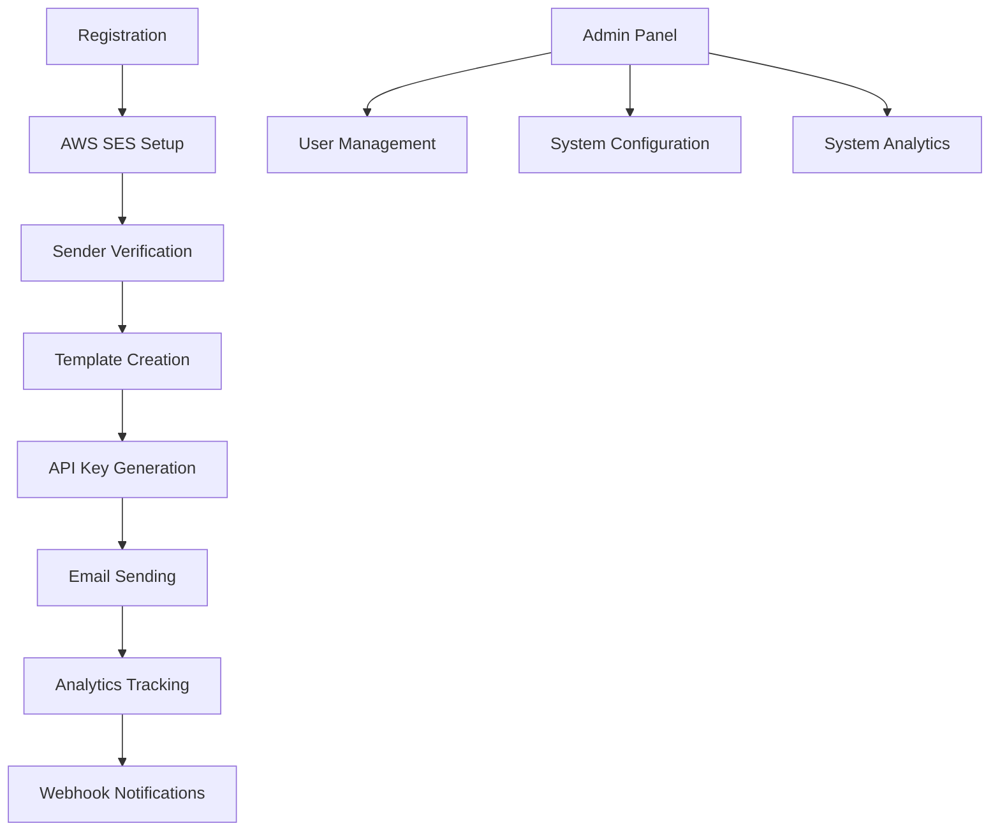

## 1. Product Overview
Email service platform for transactional and marketing emails using AWS SES, providing developers with reliable email delivery, templates, analytics, and webhook support. This service enables businesses to send automated transactional emails and marketing campaigns with high deliverability rates.

Target users are developers and businesses who need to integrate email functionality into their applications without managing email infrastructure complexity.

## 2. Core Features

### 2.1 User Roles
| Role | Registration Method | Core Permissions |
|------|---------------------|------------------|
| Developer | Email registration | API access, email sending, template management, analytics viewing |
| Admin | Manual creation | Full system access, user management, system configuration |

### 2.2 Feature Module
Our email service requirements consist of the following main pages:
1. **Dashboard**: Overview of email statistics, recent activity, and quick actions.
2. **Email Templates**: Template creation, editing, and management for both transactional and marketing emails.
3. **Send Email**: Interface for sending individual emails or campaigns with template selection.
4. **Analytics**: Detailed reports on email delivery, open rates, click rates, and bounce rates.
5. **API Keys**: Management of API keys for integration with external applications.
6. **Webhooks**: Configuration of webhook endpoints for real-time delivery notifications.
7. **Settings**: Account configuration, sender verification, and AWS SES integration setup.

### 2.3 Page Details
| Page Name | Module Name | Feature description |
|-----------|-------------|---------------------|
| Dashboard | Statistics Overview | Display total emails sent, delivery rate, open rate, and bounce rate with time-based filtering. |
| Dashboard | Recent Activity | Show recent email sends with status indicators and quick view of email details. |
| Dashboard | Quick Actions | Provide shortcuts to send email, create template, and view analytics. |
| Email Templates | Template List | Display all templates with search, filter by type (transactional/marketing), and status indicators. |
| Email Templates | Template Editor | Create and edit HTML/text templates with variable placeholders, preview functionality, and save as draft. |
| Email Templates | Template Testing | Send test emails to verify template rendering and deliverability before going live. |
| Send Email | Single Email | Send individual emails with recipient, subject, template selection, and custom variables. |
| Send Email | Bulk Campaign | Upload recipient lists, schedule campaigns, and track campaign progress with real-time updates. |
| Analytics | Delivery Reports | View email delivery status (sent, delivered, bounced, complained) with detailed breakdowns. |
| Analytics | Engagement Metrics | Track open rates, click rates, unsubscribe rates with time-series charts and export capabilities. |
| Analytics | Event Timeline | Detailed timeline of email events (sent, delivered, opened, clicked, bounced) for troubleshooting. |
| API Keys | Key Management | Generate, revoke, and manage API keys with different permission levels and usage tracking. |
| API Keys | API Documentation | Interactive API documentation with code examples and testing interface. |
| Webhooks | Endpoint Management | Add, edit, and delete webhook endpoints with URL validation and secret key configuration. |
| Webhooks | Event Configuration | Select specific email events to receive webhook notifications for. |
| Webhooks | Delivery Logs | View webhook delivery attempts with status, response codes, and retry history. |
| Settings | Account Settings | Update account information, change password, and configure notification preferences. |
| Settings | Sender Verification | Manage verified sender emails and domains with DNS configuration instructions. |
| Settings | AWS Integration | Configure AWS SES credentials, region selection, and quota management. |

## 3. Core Process

### Developer Flow
1. User registers account and verifies email
2. User configures AWS SES integration with credentials
3. User verifies sender email addresses/domains
4. User creates email templates with variables
5. User generates API keys for application integration
6. Application sends emails via API with template and recipient data
7. System tracks email delivery and engagement events
8. User monitors analytics and webhook notifications

### Admin Flow
1. Admin accesses system administration panel
2. Admin manages user accounts and permissions
3. Admin monitors system-wide email statistics
4. Admin configures system settings and limits

## 4. User Interface Design

### 4.1 Design Style
- **Primary Color**: #2563eb (Blue) - Professional and trustworthy
- **Secondary Color**: #64748b (Slate Gray) - Neutral and readable
- **Success Color**: #10b981 (Green) - Positive actions and success states
- **Error Color**: #ef4444 (Red) - Errors and warnings
- **Button Style**: Rounded corners (8px radius), subtle shadows, hover effects
- **Font**: Inter font family, 14px base size, clear hierarchy
- **Layout**: Card-based layout with consistent spacing (16px grid)
- **Icons**: Heroicons for consistency, filled variants for active states

### 4.2 Page Design Overview
| Page Name | Module Name | UI Elements |
|-----------|-------------|-------------|
| Dashboard | Statistics Cards | Clean metric cards with large numbers, percentage indicators, and trend arrows. Blue primary color with subtle gradients. |
| Dashboard | Activity Feed | Scrollable list with avatar icons, status badges (green for delivered, red for bounced), and timestamp formatting. |
| Email Templates | Template Grid | Responsive grid layout with template preview thumbnails, status pills, and action dropdowns. Hover effects on cards. |
| Email Templates | Editor Interface | Split-pane view with code editor on left and live preview on right. Syntax highlighting for HTML/CSS. |
| Send Email | Form Layout | Two-column form with recipient details on left and template selection on right. Progress indicator for bulk uploads. |
| Analytics | Charts | Time-series line charts with interactive tooltips, pie charts for status breakdown, and export buttons. |
| API Keys | Key Table | Secure display with masked keys, copy-to-clipboard functionality, and usage statistics. |

### 4.3 Responsiveness
Desktop-first design approach with mobile adaptation. Touch interaction optimization for mobile devices. Responsive breakpoints at 768px and 1024px. Collapsible navigation for smaller screens.