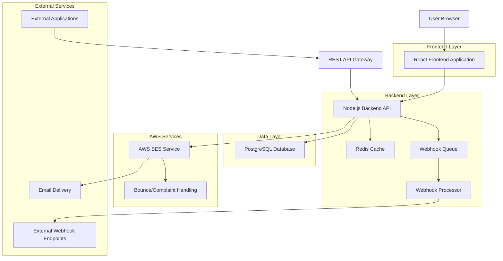
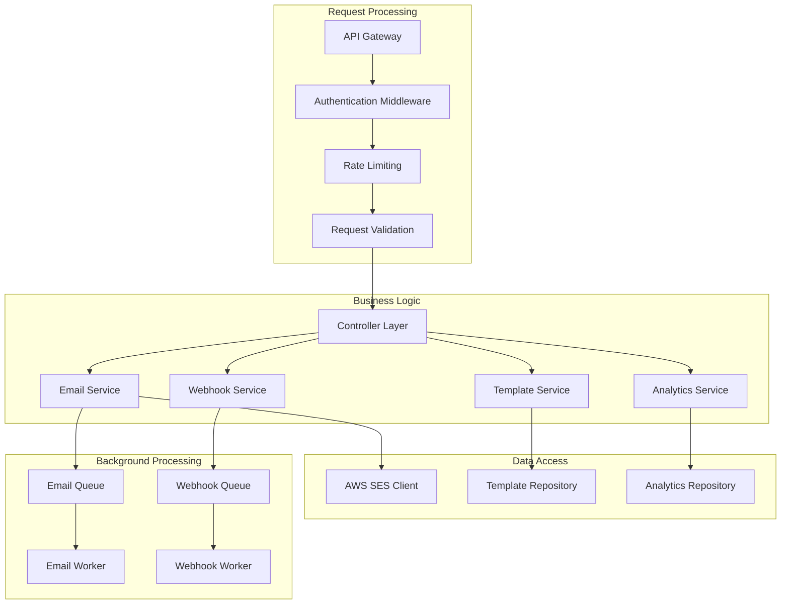
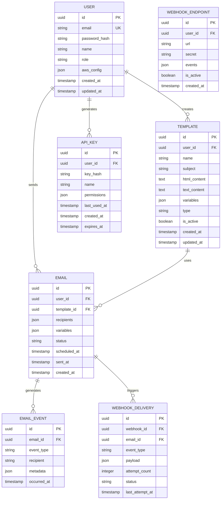

## 1. Architecture design



## 2. Technology Description

- Frontend: React@18 + tailwindcss@3 + vite
- Backend: Node.js@20 + Express@4 + TypeScript
- Database: PostgreSQL@15
- Cache: Redis@7
- Email Service: AWS SES
- Queue: Bull Queue (Redis-based)
- File Storage: AWS S3 (for email attachments)
- Monitoring: Winston Logger + Sentry
- Testing: Jest + Supertest
- Initialization Tool: vite-init

## 3. Route definitions

| Route | Purpose |
|-------|---------|
| / | Dashboard with email statistics and overview |
| /login | User authentication and login page |
| /register | User registration page |
| /templates | Email template management interface |
| /templates/new | Create new email template |
| /templates/edit/:id | Edit existing email template |
| /send | Email sending interface |
| /analytics | Email analytics and reporting |
| /api-keys | API key management |
| /webhooks | Webhook configuration |
| /settings | Account and system settings |

## 4. API definitions

### 4.1 Authentication APIs

```
POST /api/auth/register
```

Request:
| Param Name | Param Type | isRequired | Description |
|------------|------------|------------|-------------|
| email | string | true | User email address |
| password | string | true | User password (min 8 chars) |
| name | string | true | User full name |

Response:
| Param Name | Param Type | Description |
|------------|------------|-------------|
| success | boolean | Registration status |
| token | string | JWT authentication token |
| user | object | User object with id, email, name |

```
POST /api/auth/login
```

Request:
| Param Name | Param Type | isRequired | Description |
|------------|------------|------------|-------------|
| email | string | true | User email address |
| password | string | true | User password |

Response:
| Param Name | Param Type | Description |
|------------|------------|-------------|
| success | boolean | Login status |
| token | string | JWT authentication token |
| user | object | User object with permissions |

### 4.2 Email APIs

```
POST /api/emails/send
```

Request:
| Param Name | Param Type | isRequired | Description |
|------------|------------|------------|-------------|
| recipients | array | true | Array of recipient objects |
| templateId | string | true | Template identifier |
| variables | object | false | Template variables |
| scheduledAt | string | false | ISO timestamp for scheduled sending |

Response:
| Param Name | Param Type | Description |
|------------|------------|-------------|
| success | boolean | Send status |
| messageId | string | Unique message identifier |
| estimatedDelivery | number | Estimated delivery time in seconds |

```
GET /api/emails/status/:messageId
```

Response:
| Param Name | Param Type | Description |
|------------|------------|-------------|
| messageId | string | Message identifier |
| status | string | Current status (sent, delivered, bounced, complained) |
| events | array | Array of email events with timestamps |
| deliveredAt | string | Delivery timestamp |
| openedAt | string | First open timestamp |
| clickedAt | string | First click timestamp |

### 4.3 Template APIs

```
POST /api/templates
```

Request:
| Param Name | Param Type | isRequired | Description |
|------------|------------|------------|-------------|
| name | string | true | Template name |
| subject | string | true | Email subject line |
| htmlContent | string | true | HTML template content |
| textContent | string | false | Plain text version |
| variables | array | false | Array of variable definitions |
| type | string | true | Template type (transactional/marketing) |

Response:
| Param Name | Param Type | Description |
|------------|------------|-------------|
| success | boolean | Creation status |
| templateId | string | Unique template identifier |
| previewUrl | string | URL to preview template |

### 4.4 Analytics APIs

```
GET /api/analytics/overview
```

Query Parameters:
| Param Name | Param Type | isRequired | Description |
|------------|------------|------------|-------------|
| startDate | string | false | Start date (ISO format) |
| endDate | string | false | End date (ISO format) |
| templateId | string | false | Filter by template |

Response:
| Param Name | Param Type | Description |
|------------|------------|-------------|
| totalSent | number | Total emails sent |
| totalDelivered | number | Total emails delivered |
| totalBounced | number | Total bounced emails |
| totalComplained | number | Total spam complaints |
| openRate | number | Percentage of opened emails |
| clickRate | number | Percentage of clicked emails |
| bounceRate | number | Percentage of bounced emails |

## 5. Server architecture diagram



## 6. Data model

### 6.1 Data model definition



### 6.2 Data Definition Language

User Table (users)
```sql
CREATE TABLE users (
    id UUID PRIMARY KEY DEFAULT gen_random_uuid(),
    email VARCHAR(255) UNIQUE NOT NULL,
    password_hash VARCHAR(255) NOT NULL,
    name VARCHAR(100) NOT NULL,
    role VARCHAR(20) DEFAULT 'developer' CHECK (role IN ('developer', 'admin')),
    aws_config JSONB,
    created_at TIMESTAMP WITH TIME ZONE DEFAULT NOW(),
    updated_at TIMESTAMP WITH TIME ZONE DEFAULT NOW()
);

CREATE INDEX idx_users_email ON users(email);
CREATE INDEX idx_users_role ON users(role);
```

Template Table (templates)
```sql
CREATE TABLE templates (
    id UUID PRIMARY KEY DEFAULT gen_random_uuid(),
    user_id UUID NOT NULL REFERENCES users(id) ON DELETE CASCADE,
    name VARCHAR(255) NOT NULL,
    subject VARCHAR(500) NOT NULL,
    html_content TEXT NOT NULL,
    text_content TEXT,
    variables JSONB DEFAULT '[]',
    type VARCHAR(20) CHECK (type IN ('transactional', 'marketing')),
    is_active BOOLEAN DEFAULT true,
    created_at TIMESTAMP WITH TIME ZONE DEFAULT NOW(),
    updated_at TIMESTAMP WITH TIME ZONE DEFAULT NOW()
);

CREATE INDEX idx_templates_user_id ON templates(user_id);
CREATE INDEX idx_templates_type ON templates(type);
CREATE INDEX idx_templates_active ON templates(is_active);
```

Email Table (emails)
```sql
CREATE TABLE emails (
    id UUID PRIMARY KEY DEFAULT gen_random_uuid(),
    user_id UUID NOT NULL REFERENCES users(id) ON DELETE CASCADE,
    template_id UUID REFERENCES templates(id) ON DELETE SET NULL,
    recipients JSONB NOT NULL,
    variables JSONB DEFAULT '{}',
    status VARCHAR(20) DEFAULT 'pending' CHECK (status IN ('pending', 'sent', 'delivered', 'bounced', 'complained', 'failed')),
    scheduled_at TIMESTAMP WITH TIME ZONE,
    sent_at TIMESTAMP WITH TIME ZONE,
    created_at TIMESTAMP WITH TIME ZONE DEFAULT NOW()
);

CREATE INDEX idx_emails_user_id ON emails(user_id);
CREATE INDEX idx_emails_template_id ON emails(template_id);
CREATE INDEX idx_emails_status ON emails(status);
CREATE INDEX idx_emails_scheduled_at ON emails(scheduled_at);
```

Email Events Table (email_events)
```sql
CREATE TABLE email_events (
    id UUID PRIMARY KEY DEFAULT gen_random_uuid(),
    email_id UUID NOT NULL REFERENCES emails(id) ON DELETE CASCADE,
    event_type VARCHAR(50) NOT NULL CHECK (event_type IN ('sent', 'delivered', 'opened', 'clicked', 'bounced', 'complained', 'failed')),
    recipient VARCHAR(255) NOT NULL,
    metadata JSONB,
    occurred_at TIMESTAMP WITH TIME ZONE DEFAULT NOW()
);

CREATE INDEX idx_email_events_email_id ON email_events(email_id);
CREATE INDEX idx_email_events_type ON email_events(event_type);
CREATE INDEX idx_email_events_recipient ON email_events(recipient);
CREATE INDEX idx_email_events_occurred_at ON email_events(occurred_at);
```

API Keys Table (api_keys)
```sql
CREATE TABLE api_keys (
    id UUID PRIMARY KEY DEFAULT gen_random_uuid(),
    user_id UUID NOT NULL REFERENCES users(id) ON DELETE CASCADE,
    key_hash VARCHAR(255) UNIQUE NOT NULL,
    name VARCHAR(255) NOT NULL,
    permissions JSONB DEFAULT '{}',
    last_used_at TIMESTAMP WITH TIME ZONE,
    created_at TIMESTAMP WITH TIME ZONE DEFAULT NOW(),
    expires_at TIMESTAMP WITH TIME ZONE
);

CREATE INDEX idx_api_keys_user_id ON api_keys(user_id);
CREATE INDEX idx_api_keys_key_hash ON api_keys(key_hash);
```

Webhook Endpoints Table (webhook_endpoints)
```sql
CREATE TABLE webhook_endpoints (
    id UUID PRIMARY KEY DEFAULT gen_random_uuid(),
    user_id UUID NOT NULL REFERENCES users(id) ON DELETE CASCADE,
    url VARCHAR(500) NOT NULL,
    secret VARCHAR(255),
    events JSONB DEFAULT '[]',
    is_active BOOLEAN DEFAULT true,
    created_at TIMESTAMP WITH TIME ZONE DEFAULT NOW()
);

CREATE INDEX idx_webhook_endpoints_user_id ON webhook_endpoints(user_id);
CREATE INDEX idx_webhook_endpoints_active ON webhook_endpoints(is_active);
```

Webhook Deliveries Table (webhook_deliveries)
```sql
CREATE TABLE webhook_deliveries (
    id UUID PRIMARY KEY DEFAULT gen_random_uuid(),
    webhook_id UUID NOT NULL REFERENCES webhook_endpoints(id) ON DELETE CASCADE,
    email_id UUID NOT NULL REFERENCES emails(id) ON DELETE CASCADE,
    event_type VARCHAR(50) NOT NULL,
    payload JSONB NOT NULL,
    attempt_count INTEGER DEFAULT 0,
    status VARCHAR(20) DEFAULT 'pending' CHECK (status IN ('pending', 'delivered', 'failed')),
    last_attempt_at TIMESTAMP WITH TIME ZONE,
    created_at TIMESTAMP WITH TIME ZONE DEFAULT NOW()
);

CREATE INDEX idx_webhook_deliveries_webhook_id ON webhook_deliveries(webhook_id);
CREATE INDEX idx_webhook_deliveries_email_id ON webhook_deliveries(email_id);
CREATE INDEX idx_webhook_deliveries_status ON webhook_deliveries(status);
```
